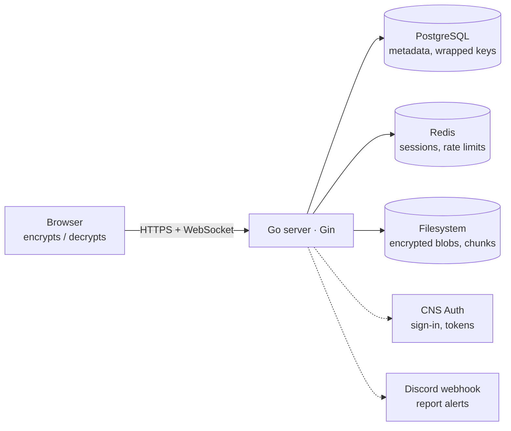

# Sendly Architecture

How Sendly is built, what it stores, and how the pieces fit together. Companion docs: [API.md](API.md), [SECURITY.md](SECURITY.md), [OPERATIONS.md](OPERATIONS.md).

## Overview

Sendly is an end-to-end encrypted file sharing service. A single Go server renders the web app, exposes the JSON API, assembles uploads and serves ciphertext. All encryption and decryption happens in the browser; the server never holds a key it could use to read a file.

## Features

| Feature | What it does |
|---|---|
| **Link sharing** | Upload a file as a guest or signed-in user and get a link. The decryption key sits in the URL fragment, which browsers never send to the server. Files expire after 7 days (guests) or 90 days (accounts). Recipients can also open a file by its short numeric code. |
| **Quick share** | A temporary room (10 min to 24 h) that others join with a short code or QR. The host approves each joiner after comparing a key fingerprint, then everyone can exchange files. No account needed. |
| **Transfers** | Signed-in users send a file directly to another user, who accepts or declines. The sender wraps the file key for the recipient's public key. |
| **Accounts and devices** | Sign in via CNS Auth. Each browser is a device; new devices are approved by an existing trusted one with a verification code, or the account is recovered. |
| **My files** | Signed-in users list, search and reopen their uploads and received files across devices. |
| **Reporting** | Anyone can report a file. Enough distinct signed-in reporters auto-delete it; Discord is notified. |
| **Localization** | English and German (`internal/i18n`). |
| **Admin CLI** | `cmd/admin` to inspect, delete and download files, view reports and stats, and force cleanup. |

## Stack

- **Go + Gin**: HTTP server, templates, API, WebSockets.
- **PostgreSQL**: persistent metadata and wrapped keys. Migrations in `db/migrations`, applied on startup.
- **Redis**: transient state: upload sessions, chunk tracking, pending flags, rate-limit counters.
- **Filesystem**: encrypted file blobs and temporary chunks (`DATA_DIR`, optional `CHUNK_DIR`).
- **Frontend**: server-rendered templates in `web/templates`, vanilla JS in `web/static/js` (WebCrypto for all cryptography), no third-party scripts or fonts.
- **Optional**: CNS Auth for accounts (without it the app runs guest-only), Discord webhook for reports.

## Code layout

| Path | Purpose |
|---|---|
| `cmd/server` | Server entry point; wires config, storage, services and every route. |
| `cmd/migrate`, `cmd/admin` | Manual migrations and the admin CLI. |
| `internal/config` | Environment loading and validation. |
| `internal/handlers` | HTTP handlers: pages, auth, upload, download, reports, transfers, tunnels, devices, identity. |
| `internal/middleware` | Security headers, client IP, CNS auth bridge, CSRF, rate limiting, tiers, locale, user cache. |
| `internal/services` | Upload lifecycle, cleanup, retention, user cache, tracker, Discord, CNS client. |
| `internal/storage` | PostgreSQL, Redis and filesystem access. |
| `internal/models` | Data types and error definitions. |
| `web/` | Templates and static assets. |
| `db/migrations` | Ordered SQL migrations. |
| `legal/`, `scripts/build_legal.py` | Terms, privacy and legal notice sources and their builder. |

## Request pipeline

Global middleware, in order: recovery, logger, security headers (CSP), client-IP extraction, CNS cookie auth bridge, user cache sync, locale. The `/api` group additionally enforces CSRF. Rate limiters (standard, strict, download) are attached per route. See [API.md](API.md#conventions).

## Upload flow

1. **Init**: the client announces name, size and chunk count; the server checks the tier limit and creates a session in Redis.
2. **Chunks**: the already-encrypted file is uploaded in pieces to the chunk directory.
3. **Complete**: the server assembles the chunks into a single blob in the background. The client polls status.
4. **Finalize**: the client picks a lifetime (or a tunnel) and sends the wrapped key for its own account. The file record is saved, the pending state is removed and a share URL is returned.

Sessions that are never finalized are removed after 10 minutes.

## Device trust and identity keys

Each signed-in account has one **identity keypair** (RSA-OAEP-2048, versioned). Its private key exists only in browsers; the server keeps one copy per trusted device, wrapped for that device's own public key.

- A device is *trusted* when it holds a copy of the active identity key.
- The first device creates the key. Later devices request **enrollment**: they show a verification code and a trusted device approves, re-wrapping the identity key for the newcomer.
- **Recovery** (no device left) creates a new key version and revokes all devices. Files wrapped for old versions stay locked until a device that still holds the old key **rescues** them.
- A file key is stored per user wrapped with their identity public key (`owner` for uploads, `share` for accepted transfers), so any trusted device can open it.

## Quick share

The host's browser generates a session password and wraps it for each approved participant's throwaway public key. Guests need no account: they hold a token (`X-Host-Token` / `X-Participant-Token`) bound to their device. Membership, host approval and key envelopes are checked on every endpoint ([SECURITY.md](SECURITY.md#authorization)).

Tunnel status: `pending` → `joined` → `active` → `ended`, or `expired`.

## Data model

### PostgreSQL

| Area | Tables | Notes |
|---|---|---|
| Files | `files` | `id`, `numeric_code`, `original_name`, `size_bytes`, owner / uploader, optional tunnel, `expires_at`, report count, deletion flag. |
| File keys | `file_access_key_envelopes` | A signed-in user's key copy, wrapped for their identity key version; `access_kind` is `owner` or `share`. |
| | `file_key_envelopes` | A quick share guest upload's key, wrapped for the guest's throwaway key. |
| | `tunnel_participant_envelopes` | The tunnel session key wrapped for each approved participant. |
| | `file_recipient_key_envelopes` | Legacy, no longer written. |
| Devices | `user_devices` | Device ID, owning user, label, public key (JWK), algorithm / version, active or revoked. |
| Identity | `user_identity_keys` | Public key per `key_version`, one active at a time. |
| | `user_identity_key_device_envelopes` | Each trusted device's wrapped copy of an identity private key. |
| | `user_key_envelopes`, `legacy_identity_escrow` | Legacy, only used by the temporary migration. |
| Enrollment | `device_enrollments` | Request device, verification code, status (`pending`, `approved`, `rejected`, `expired`), approver, expiry. |
| Transfers | `file_transfers` | Sender, recipient, file, status (`pending`, `accepted`, `declined`). |
| Reports | `reports` | File, reporter IP and, if signed in, reporter user (unique per file), optional transfer. |
| Tunnels | `tunnels`, `tunnel_participants`, `tunnel_rejections` | Short code, host, duration, status; participants with throwaway public keys and `approved`; declined joiners. |
| Users | `users` | Local cache of CNS profiles: username and avatar from CNS, for display and recipient search. |
| Tracking | `uploads_by_ip`, `data_counters`, `instance_meta` | Per-IP upload and data counters; the instance ID used for [storage ownership](OPERATIONS.md#storage-ownership). |

### Redis

Upload session metadata, chunk tracking, pending-file flags, assembly status and rate-limit counters. Nothing here is the source of truth for files.

### Filesystem

Final encrypted blobs keyed by file ID, temporary chunk directories keyed by session ID, and a `.sendly-instance` marker per storage directory.

## Background work

| Job | Interval | What it does |
|---|---|---|
| Cleanup | 5 min | Marks expired files deleted, removes their blobs, orphaned chunks and blobs missing from the DB, then runs [data retention](OPERATIONS.md#data-retention). |
| Pending-upload cleanup | 1 min | Drops abandoned upload sessions and stale pending artifacts. |
| User cache reconcile | `USER_CACHE_RECONCILE_INTERVAL_MINUTES` | Re-syncs cached CNS profiles. |
| Stats reporter | `STATS_REPORT_INTERVAL_MINUTES` | Reports usage stats when a bot URL is configured. |

## WebSockets

`/api/me/devices/ws` pushes live account events: enrollment requests and decisions, and transfer updates.
